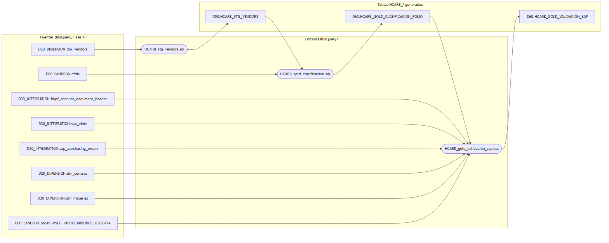

# ConsultasBigQuery

SQL de producto de proan-Hidrocarburos: construye las tablas `HCARB_*` que
lee la herramienta. No es investigación (eso vive en
`Datos/PHASE1/queries/` y `Datos/PHASE2/queries/`) — esto se mantiene y se
re-ejecuta. Diseño completo (por qué, columnas, máquina de estados) en
[`Datos/PHASE2/resumen.md`](../Datos/PHASE2/resumen.md) y
[`Datos/PHASE2/Esquema.md`](../Datos/PHASE2/Esquema.md).

**Estado actual: ejecutadas y validadas contra BigQuery (jul-2026)**. Al
ejecutar aparecieron 6 bugs reales que ninguna revisión estática detectó
(detalle en el header de cada `.sql`): partición `ROW_NUMBER()` por `FLOAT64`
no permitida, nombre real de columna `BELNR_account_document_number`,
`TIMESTAMP` vs `DATE` en `DATE_DIFF`, ventana de fecha ausente en el matcher
numérico de `sap_ekbe` (inflaba `sitio_consumo` a 72% en vez de ~54-58%),
filtro de material de gas ausente en el extracto MSEG (inflaba
`tiene_recepcion_mseg` a 48% en vez de ~2%), y `es_mixta` comparando contra
`Total` (con IVA) en vez de `SubTotal` sin tolerancia de redondeo (daba 100%
mixtas en vez de ~74%). Cifras finales contra los benchmarks de Fase 1: 1.051
facturas, ~$40.2M, 11 proveedores, 74.3% mixtas, 898 validada_sap, 569 con
sitio, 21 con recepción MSEG — todo dentro de lo esperado.

**D26:** `HCARB_GOLD_CLASIFICACION_LINEA` (no bug) salió con el mismo número
de filas que `_FOLIO` (1.051=1.051) — los conceptos no-gas de una factura
mixta no se guardan como filas aparte en `cfdis` (Fase 1 §16), sin desglose
real que mostrar. **Eliminada** de `HCARB_gold_clasificacion.sql` y borrada
de BigQuery (`DROP TABLE`, jul-2026, autorizado explícitamente). Quedan 3
tablas `HCARB_*` vivas: `HCARB_STG_VENDORS` (D50), `HCARB_GOLD_CLASIFICACION_FOLIO`
y `HCARB_GOLD_VALIDACION_SAP` (D60).

## Datasets (reutilizados, ninguno nuevo)

- `D50_AGGREGATE_RENTABILIDAD` — tablas `HCARB_STG_*` (staging/dedupe).
- `D60_REPORTING` — tablas `HCARB_GOLD_*` (preparadas para la herramienta),
  mismo dataset donde viven las `MAKA_GOLD_*` de Maka.

## Orden de ejecución (dependencias)

1. `HCARB_stg_vendors.sql`
2. `HCARB_gold_clasificacion.sql` (depende de 1)
3. `HCARB_gold_validacion_sap.sql` (depende de 2)

Fuente editable en [`linaje-tablas.mmd`](./linaje-tablas.mmd). Para
regenerar: `npx -y @mermaid-js/mermaid-cli -i linaje-tablas.mmd -o linaje-tablas.png -b white -s 2`

Pensado para quedar como tasks de un DAG de **Airflow** — no Cloud Run Job
como el patrón `materialize_alerts.py` de Maka. Por ahora se corre a mano
para el backfill histórico.

## Qué NO está aquí

- `HCARB_gold_aprobacion` — tabla mutable del **backend** (dos roles:
  Compras/Gerencia), no una query de cálculo.
- `HCARB_ESTATUS_SAT` — poblada por una task de Airflow que llama al
  webservice del SAT, no por un `SELECT` sobre BigQuery.

Detalle de ambas en `Datos/PHASE2/Esquema.md` §4-5.
