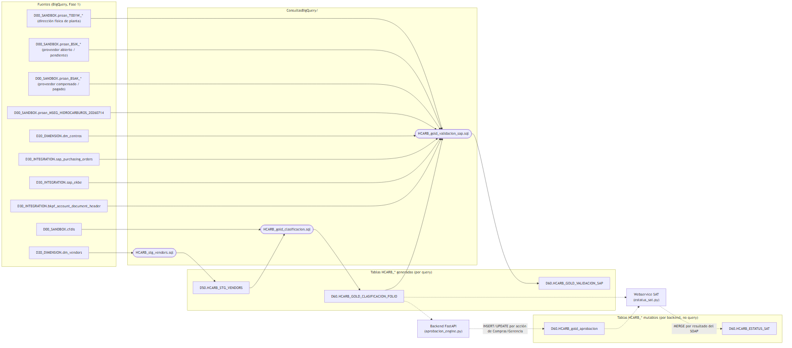

# ConsultasBigQuery

SQL de producto de proan-Hidrocarburos: construye las tablas `HCARB_*` que
lee la herramienta — esto se mantiene y se re-ejecuta. Por qué el cruce
CFDI↔SAP nunca es exacto (grano distinto entre sistemas, tolerancias,
CECO/sitio como evidencia y no como dato exacto) en
[`Datos/naturaleza-de-los-datos.md`](../Datos/naturaleza-de-los-datos.md).

**Estado actual: ejecutadas y validadas contra BigQuery (jul-2026)**. Al
ejecutar aparecieron 6 bugs reales que ninguna revisión estática detectó
(detalle en el header de cada `.sql`): partición `ROW_NUMBER()` por `FLOAT64`
no permitida, nombre real de columna `BELNR_account_document_number`,
`TIMESTAMP` vs `DATE` en `DATE_DIFF`, ventana de fecha ausente en el matcher
numérico de `sap_ekbe` (inflaba `sitio_consumo` a 72% en vez de ~54-58%),
filtro de material de gas ausente en el extracto MSEG (inflaba
`tiene_recepcion_mseg` a 48% en vez de ~2%), y `es_mixta` comparando contra
`Total` (con IVA) en vez de `SubTotal` sin tolerancia de redondeo (daba 100%
mixtas en vez de ~74%). Cifras finales contra los benchmarks de Fase 1: 1.051
facturas, ~$40.2M, 11 proveedores, 74.3% mixtas, 898 validada_sap (solo RE; hoy
955 con la 2ª fuente de validación, ver abajo), 569 con sitio, 21 con recepción
MSEG — todo dentro de lo esperado. **El "21 con recepción MSEG" resultó ser el
bug, no el hallazgo** — ver el fix de más abajo, que lo sube a 505.

**D26:** `HCARB_GOLD_CLASIFICACION_LINEA` (no bug) salió con el mismo número
de filas que `_FOLIO` (1.051=1.051) — los conceptos no-gas de una factura
mixta no se guardan como filas aparte en `cfdis` (Fase 1 §16), sin desglose
real que mostrar. **Eliminada** de `HCARB_gold_clasificacion.sql` y borrada
de BigQuery (`DROP TABLE`, jul-2026, autorizado explícitamente). Quedan 3
tablas `HCARB_*` vivas: `HCARB_STG_VENDORS` (D50), `HCARB_GOLD_CLASIFICACION_FOLIO`
y `HCARB_GOLD_VALIDACION_SAP` (D60).

**Trazabilidad de clasificación (jul-2026):** `HCARB_GOLD_CLASIFICACION_FOLIO`
lleva ahora `claves_gas` (array de claves SAT distintas que clasificaron la
factura) y `conceptos_gas` (array de líneas de gas con clave, descripción,
cantidad, unidad, valor unitario e importe). Hacen la clasificación auditable
factura a factura en la propia UI (M1) en vez de esconder el criterio en el
SQL. Al exponerlas se confirmó que **ninguna de las 6 claves de la Propuesta
(15111501–15111506) aparece en los datos reales**: el universo factura con
`15111510` ("LITROS DE GAS, LP", 1.035 facturas), `15111512` ("GAS NATURAL
VEHICULAR COMPRIMIDO", 18) y `83101600` (servicio GNC, 3). Por eso el
clasificador filtra por prefijo `151115%` + `83101600/01`, no por la lista
literal de 6 — ceñirse a ella clasificaría 0 facturas. (Feed `cfdis` mutable:
el total subió de 1.051 a 1.056 desde el backfill inicial.)

**Ventana de fecha en los matchers exactos (jul-2026):** `match_sap_exacto` y
`sitio_exacto` casaban por `folio_key` (Serie+Folio) **sin acotar fecha** — el
folio se reutiliza entre ejercicios, así que una colisión de folio años atrás
colaba (2 casos, uno a 1071 días) y, peor, **tapaba el match numérico bueno**
(el numérico solo corre si no hubo exacto). Se añadió ventana de **90 días** a
ambos exactos (más holgada que los 15 del numérico porque el folio completo es
evidencia fuerte). Efecto: la diferencia de fecha máxima entre validadas cae de
1071 a 12 días; las 2 colisiones pasan a `sin_match_sap` (flag suave). Ahora que
`dias_diferencia` es visible en el Portal de Compras (M2), esto evita mostrar
matches falsos a quien valida.

**Segunda fuente de validación + estado de pago (Fase-1-bis, jul-2026):** además
del registro FI (documento `RE` en `bkpf`), `estado_sap` valida ahora también por
**partida de proveedor**: folio + **mismo proveedor** (`LIFNR` = `id_proveedor` de
la factura) contra `proan_BSAK_*` (compensadas = pagadas) y `proan_BSIK_*` (abiertas
= pendientes). Como corrobora el proveedor, es a prueba de colisiones de folio **sin
ventana de fecha** (la cabecera BKPF no trae proveedor, por eso el matcher RE sí la
necesita; exigir el proveedor tiró 670→604 matches, y esos 66 eran justo colisiones).
Efecto: las validadas suben de **899 (85%) a 955 (90,4%)** — la unión de ambas
fuentes — y de paso se obtiene el **estado de pago** (600 pagadas / 4 pendientes),
base para el Módulo 4. Columnas nuevas: `fuente_sap`
(`RE`/`partida_proveedor`/`RE+partida`), `estado_pago_sap`, `belnr_pago_sap`,
`fecha_pago_sap`. El techo teórico era 990 (94%) usando RE sin ventana, pero eso
reabre las colisiones que la ventana corta (solo +35), así que no se toca. El barrido
completo de `proan-quantrue` que lo motivó — y por qué el **CECO** sigue sin poder
derivarse de forma exacta (ACDOCA acotado a la sociedad `ETC`, no las del gas;
`0FI_GL_14` congelado en 2024; sin `EKKN`) está en
[`Datos/naturaleza-de-los-datos.md`](../Datos/naturaleza-de-los-datos.md).

**Dirección de Consumo vía `T001W` (Fase-1-bis, jul-2026):** la Propuesta pide mostrar
la "Dirección de Consumo" (punto físico de entrega); Fase 1 la dio por inexistente, pero
el maestro de plantas `proan_T001W_*` **sí** trae la dirección postal por `WERKS` (`STRAS`
calle, `ORT01` ciudad, `REGIO` región). Se expone en la columna nueva `direccion_sitio`
(concatena solo las partes no vacías; p.ej. PAN1 = "Km.2 Carret. San Juan - Guadal, JAL"),
para el mismo ~58% de facturas con `WERKS` resuelto. La calle viene truncada en el propio
maestro SAP. `ORT01`/`PSTLZ` suelen venir vacías.

**Fix del cruce CFDI↔MSEG (Fase-1-bis-2, jul-2026): 2% → 48%.** El filtro de
"es gas" en MSEG (`MATNR` en el catálogo de 6 materiales de `dm_material`)
descartaba las recepciones que SAP contabiliza por cuenta contable directa
sin material (`MATNR` vacío, `SAKTO='0005010611'`) — el patrón **dominante**
incluso para el único proveedor con `MATNR` poblado (Gas Noel: 4.991 filas
por cuenta vs. 52 por material). El filtro correcto es por proveedor
(`LIFNR` = uno de los 11 ya identificados en `HCARB_STG_VENDORS`), no por
material — estas 11 son distribuidoras de gas dedicadas, así que no hay
riesgo de colar diésel/insecticida al quitar el filtro de material. Se portó
también el patrón de score+fallback numérico de folio (como `sap_match`/
`sitio_match`) y agregación a grano documento (`MBLNR`, confirmando que
`XBLNR_MKPF`/`BUDAT_MKPF` son de cabecera). Resultado: `tiene_recepcion_mseg`
(booleano) se reemplaza por `confianza_mseg` (`'Alta'`/`'Media'`/`NULL`) —
505/1.056 (48%) con evidencia de recepción (54 Alta: folio e importe casan
exacto; 451 Media: solo el folio casa, el documento SAP suele ser una
recepción consolidada de varias entregas/facturas, así que su importe no
reconcilia el monto de esta factura en particular). Auditado contra
BigQuery real (`ZZ_PRUEBAS.hcarb_mseg_scored_try`): 0 UUIDs/documentos
duplicados, 0 colisiones de folio por proveedor. Corrige también el
hallazgo "~98% sin MSEG" de la investigación original de Fase 1 (retirada,
ver historial de git) — era un artefacto del filtro de material, no un
techo estructural de los datos.

**CECO sugerido (jul-2026, revierte D22): 51% de las facturas.** Se midió que
solo 201/505 documentos MSEG traen un `KOSTL` único y limpio (la mitad reparte
el gasto entre 2-14 centros de coste sin que ninguno domine) — pero **6 de los
11 proveedores son de un solo sitio real** (≥95% de concentración histórica),
así que su CECO es predecible por proveedor, sin depender del match de
documento. Columna nueva `ceco_sugerido` (patrón de proveedor → `KOSTL` del
documento, uno o varios separados por coma → `NULL`): 543/1.056 con
sugerencia (292 únicas, 251 con varios candidatos). Prellena el campo CECO en
`aprobacion-workspace.tsx`, sigue 100% editable — nunca bloquea.

**Cutoff de fecha de negocio `>=2026-01-01` (D31, jul-2026): 1.056 → 547 facturas.**
`proan_MSEG_HIDROCARBUROS_20260714` solo cubre `MJAHR=2026`, pero `cfdis` no
tenía piso de fecha y arrancaba ~jun-2025 — ~7 de ~13-14 meses que MSEG nunca
podía validar (el dato no existe en SAP para ese rango), diluyendo los
indicadores de cobertura. Se añadió `DECLARE cutoff_fecha_negocio DATE DEFAULT
'2026-01-01'` en `HCARB_gold_clasificacion.sql`, exigiendo `FechaTimbrado` **y**
`Fecha` `>=` el cutoff (ambos campos, no solo uno) en el `WHERE` de `cfdis_dedup`
— único punto de corte, `HCARB_gold_validacion_sap.sql` lo hereda vía el `JOIN`
a `HCARB_GOLD_CLASIFICACION_FOLIO`, y `catalog()`/frontend/dashboard no
necesitaron ningún cambio de código. Efecto medido contra BigQuery real:
`confianza_mseg` (Alta/Media) sube de 48% a **90,7%** (confirma que el 48%
previo era un artefacto de cobertura temporal, no un techo de matching real),
`validada_sap` 90,4%→91,0%, `con_sitio` 70,4% (antes ~58%, medido sobre el
histórico completo con peor cobertura SAP). Huérfanos pre-2026 en las tablas
mutables `HCARB_gold_aprobacion` (509 filas, ninguna ya `aprobada`/`rechazada`)
y `HCARB_ESTATUS_SAT` (506 filas) se borraron con `DELETE` explícito.

## Datasets (reutilizados, ninguno nuevo)

- `D50_AGGREGATE_RENTABILIDAD` — tablas `HCARB_STG_*` (staging/dedupe).
- `D60_REPORTING` — tablas `HCARB_GOLD_*` (preparadas para la herramienta),
  mismo dataset donde viven las `MAKA_GOLD_*` de Maka.

## Orden de ejecución (dependencias)

1. `HCARB_stg_vendors.sql`
2. `HCARB_gold_clasificacion.sql` (depende de 1)
3. `HCARB_gold_validacion_sap.sql` (depende de 2)

Fuente editable en [`linaje-tablas.mmd`](./linaje-tablas.mmd). Para
regenerar cualquiera de los `.mmd` de esta carpeta (este y los dos de más
abajo): `npx -y @mermaid-js/mermaid-cli -i <archivo>.mmd -o <archivo>.png -b white -s 2`

Pensado para quedar como tasks de un DAG de **Airflow** — no Cloud Run Job
como el patrón `materialize_alerts.py` de Maka. Por ahora se corre a mano
para el backfill histórico.

## Tablas mutables (no construidas por una query de esta carpeta)

`HCARB_gold_aprobacion` y `HCARB_ESTATUS_SAT` viven en el mismo dataset
(`D60_REPORTING`) pero **no las reconstruye ningún `SELECT` de aquí** —
las escribe el backend directamente (INSERT/UPDATE/MERGE fila a fila) según
acciones humanas o llamadas a un webservice externo. Por eso no hay un
`HCARB_*.sql` "de cálculo" para ellas, pero sí dejamos versionado lo que sí
es reutilizable sin leer Python:

- **`HCARB_gold_aprobacion`** (Módulo 3, dos roles: Compras/Gerencia) —
  esquema + máquina de estados completa en
  [`HCARB_gold_aprobacion_schema.sql`](./HCARB_gold_aprobacion_schema.sql),
  diagrama en [`flujo-aprobacion.png`](./flujo-aprobacion.png) (fuente
  [`flujo-aprobacion.mmd`](./flujo-aprobacion.mmd)). La escribe
  `apps/financialbi/financialbi/aprobacion_engine.py`.
- **`HCARB_ESTATUS_SAT`** (D24, estatus de cancelación ante el SAT) —
  esquema + mecánica en
  [`HCARB_estatus_sat_schema.sql`](./HCARB_estatus_sat_schema.sql), diagrama
  en [`flujo-estatus-sat.png`](./flujo-estatus-sat.png) (fuente
  [`flujo-estatus-sat.mmd`](./flujo-estatus-sat.mmd)). La escribe
  `apps/financialbi/financialbi/estatus_sat.py`, corriendo hoy a mano
  (`python -m financialbi.estatus_sat`) hasta que exista el DAG de Airflow.

`linaje-tablas.png` ya las incluye (subgrafo "Tablas mutables", con flechas
punteadas para distinguirlas de las tablas que sí construye una query).
