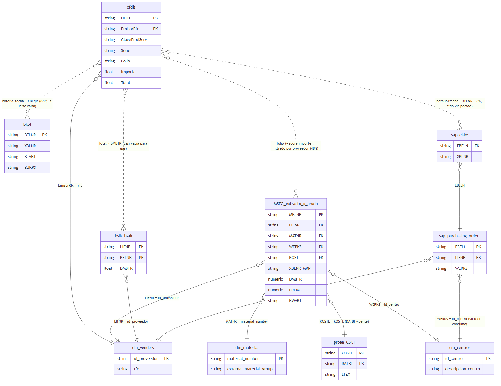
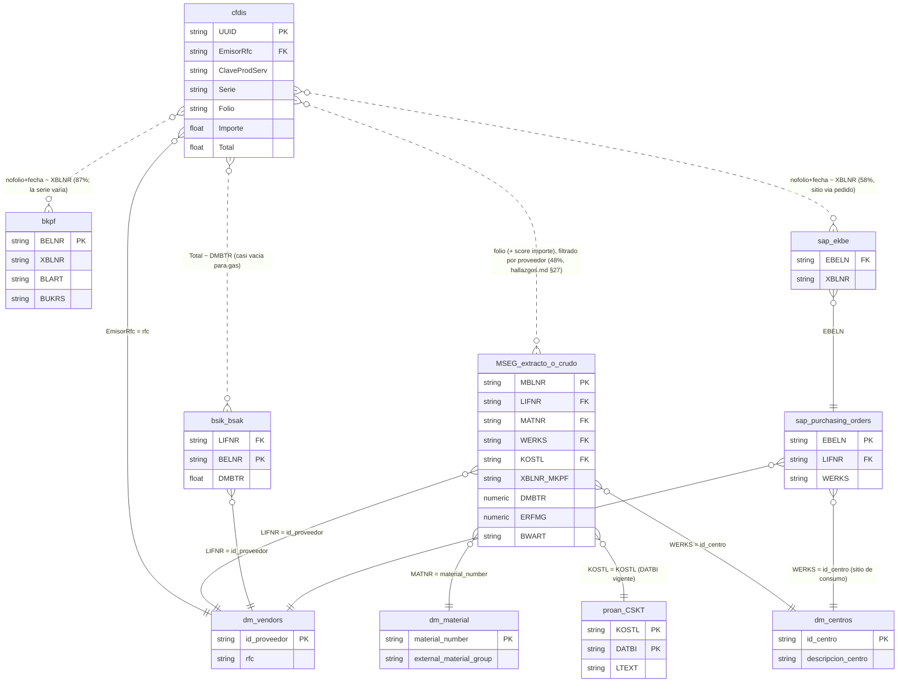

# Esquema de datos — Fase 1 (Hidrocarburos)

Mapa técnico de referencia: de qué tabla sale cada dato, qué se cruza con
qué (y por qué columna), y qué NO cruza o no existe. Esto es el complemento
técnico de [`resumen.md`](./resumen.md) (decisiones) y
[`hallazgos.md`](./hallazgos.md) (registro cronológico) — aquí no hay
narrativa de investigación, solo el mapa para que cualquiera pueda escribir
la siguiente query sin tener que redescubrir nada. Todas las tablas viven en
el proyecto BigQuery **`proan-quantrue`**.

## 1. Catálogo de tablas

### `D00_SANDBOX.cfdis` — Facturas (CFDI)

Una fila por **concepto de factura** — en la práctica **una sola fila por
`UUID`** en la gran mayoría; 24 de 1,051 facturas de gas tienen 2 filas, pero
son **duplicados exactos** del mismo concepto, no 2 líneas reales (misma
disciplina de deduplicación que MSEG/`dm_vendors` — ver §19). Regla:
deduplicar por `(UUID, ClaveProdServ, Cantidad, Importe, Descripcion)` y
agregar por `UUID`.

| Columna | Qué es | Uso en Fase 1 |
| --- | --- | --- |
| `UUID` | ID fiscal único de la factura | Clave de factura |
| `Serie`, `Folio` | Número de factura del proveedor | Se concatenan para comparar contra `XBLNR_MKPF` de MSEG |
| `EmisorRfc`, `EmisorNombre` | Proveedor | Cruce con `dm_vendors.rfc` |
| `ClaveProdServ` | Clave SAT de producto/servicio | **La clave para definir alcance**: `151115xx` = gas producto, `83101600`/`83101601` = GNC servicio, `1510xxxx` = diésel/gasolina (excluido) |
| `Importe` | Importe de este concepto (sin IVA) | Comparar contra `DMBTR` de MSEG (vía material) |
| `Cantidad`, `ClaveUnidad`, `ValorUnitario` | Cantidad/unidad/precio unitario del concepto | `ValorUnitario` es la señal más fiable del matching (ver §3) |
| `SubTotal`, `Total`, `TotalImpuestosTrasladados` | Totales de **cabecera** de la factura completa | **`Total` (con IVA) es el que hay que comparar contra `bsik`/`bsak`** — no `Importe`. **El 73.7% de las facturas de gas** tienen `SubTotal` mayor que la suma del `Importe` de la línea de gas: llevan otros conceptos no-gas que no se guardan como filas aparte (ver `hallazgos.md` §16). Consecuencia: el **gasto en gas** se suma con `Importe` (línea); el **pago** se concilia con `Total` (factura completa). |
| `TipoDeComprobante`, `Moneda` | Tipo de comprobante / moneda | El universo de gas (líneas con clave SAT de gas) es todo `'I'` (ingreso) y `MXN`. Pero **estos mismos proveedores emiten también 243 comprobantes `'P'` (complementos de pago/REP) y 9 `'E'` (notas de crédito)** hacia Proteína Animal — clave para el Módulo 4 (ver §19). **No existe columna de estatus/cancelación SAT** — ver §4. |
| `MetodoPago`, `FormaPago` | Método/forma de pago | **99.7% de las facturas de gas son `PPD`** (pago diferido) y solo 3 `PUE`. En PPD el pago se documenta después con un REP — el estatus de pago **no** está en la factura (ver hallazgos §19). |
| `FechaTimbrado`, `Fecha` | Fechas | Filtro de ventana temporal (`FechaTimbrado >= '2026-01-01'` en todas las queries) |

### `D00_SANDBOX.proan_MSEG_HIDROCARBUROS_20260714` — Extracto MSEG (¡acotado, no crudo!)

**Importante:** esta tabla ya viene pre-filtrada por quien la creó, con el
criterio `external_material_group LIKE '151115%' OR ERFME IN ('L','M3')` —
el mismo criterio que usaba `hidrocarburos.sql` y que se demostró demasiado
amplio (mezcla diésel, insecticida, detergente, etc. — ver hallazgos.md).
214 columnas (MSEG completo de SAP). Las que importan:

> **⚠️ Duplicación (verificado, ver hallazgos §18):** el 34% de las filas
> (176,465 de 518,055) son **duplicados exactos** por `(MBLNR, MJAHR, ZEILE)`
> — un lote del histórico cargado dos veces; afecta también a los documentos
> de gas. **Regla:** deduplicar por `(MBLNR, MJAHR, ZEILE)` antes de cualquier
> `SUM(DMBTR)`/`COUNT(*)` ([`queries/109`](./queries/109_duplicacion_mseg_extracto.sql)).
> Los conteos por `COUNT(DISTINCT MBLNR)` y las coberturas por `DISTINCT UUID`
> **no** se ven afectados (por eso el hallazgo central aguanta).

| Columna | Qué es | Uso en Fase 1 |
| --- | --- | --- |
| `MBLNR` | Documento de movimiento de material | Clave del documento SAP |
| `MATNR` | Material | Cruce con `dm_material.material_number` — **ver nota de formato en §6** |
| `LIFNR` | Proveedor (código SAP) | Cruce con `dm_vendors.id_proveedor` |
| `WERKS` | Planta | Cruce con `dm_centros.id_centro`. Solo 4 valores en el universo de gas: `PAN1`, `PAN3`, `PANM`, `PANR` |
| `KOSTL` | Centro de costos (CECO) | Cruce con `proan_CSKT_20260714.KOSTL` |
| `SAKTO` | Cuenta contable | Contexto, no se cruza |
| `DMBTR` | Importe del movimiento (NUMERIC en esta tabla) | Comparar contra `Importe` del CFDI (vía material) |
| `ERFMG`, `ERFME` | Cantidad y unidad de medida | Comparar contra `Cantidad`/`ClaveUnidad` del CFDI |
| `XBLNR_MKPF` | Referencia de documento (texto libre, cabecera) | **El "folio" que alguien tecleó a mano** — se compara contra `Serie+Folio` del CFDI. No es una FK real. |
| `BUDAT_MKPF`, `CPUDT_MKPF` | Fechas (como STRING `YYYYMMDD`, hay que `SAFE.PARSE_DATE`) | Fecha del movimiento |
| `BWART` | Tipo de movimiento | `101` = recepción normal, `102` = reversión/anulación de un `101`. **Filtrar los revertidos antes de conciliar.** |
| `ABLAD` | Punto de descarga (candidato a Dirección de Consumo) | **Descartado — viene vacío al 100%** |
| `USNAM_MKPF` | Usuario SAP que capturó el movimiento | Identifica a una persona — **no usar/exportar**, fuera de alcance por la regla de datos personales |
| `GSBER` | Área de negocio | Cruzable con `dm_business_area` (no usado aún) |

### `D00_SANDBOX.proan_MSEG_<YYYYMMDD>` / `proan_MSEG_<YYYYMMDD>_q<N>` — MSEG real (crudo, sin filtrar)

La tabla **de verdad completa** (no la del extracto de arriba). Centenares
de tablas fechadas: cargas trimestrales en 2023-2024
(`proan_MSEG_20230101_q1`...`q4`, etc.) y luego una tabla por día desde 2025
(`proan_MSEG_20250205`, ..., `proan_MSEG_20260720` la más reciente vista).

- **Mismas columnas que MSEG en general**, pero los campos numéricos
  (`DMBTR`, `ERFMG`, etc.) vienen como **STRING** — hay que `SAFE_CAST(... AS NUMERIC)`.
- **No es un acumulado histórico único** — parecen deltas/ventanas
  recientes: el mismo `MATNR` de gas apareció con los mismos 2 `MBLNR`
  repetidos en 12 tablas diarias seguidas (6-17 feb 2026), no una vez.
- Se puede barrer todo un año de una vez con **wildcard de BigQuery**:
  ``` `proan-quantrue.D00_SANDBOX.proan_MSEG_2026*` ``` + `_TABLE_SUFFIX`
  (así se comprobó que ningún otro proveedor de gas tiene documentos aquí).

### `D00_SANDBOX.proan_CSKT_20260714` — Maestro de CECOs (SAP CSKT)

| Columna | Qué es | Uso |
| --- | --- | --- |
| `KOSTL` | Código de CECO | Cruce con `MSEG.KOSTL` / `bsik`/`bsak.KOSTL` |
| `DATBI` | Fecha fin de vigencia | **Filtrar `DATBI = '99991231'`** (vigente) — hay CECOs con varias filas por cambio de nombre en el tiempo |
| `KTEXT` / `LTEXT` / `MCTXT` | Texto corto / largo / mayúsculas | **Usar `LTEXT`** (el más completo; `KTEXT`/`MCTXT` vienen truncados) |

### `D20_DIMENSION.dm_material` — Maestro de materiales

Solo 3 columnas: `material_number`, `material_name`, `external_material_group`.
78,009 filas. `external_material_group` es donde vive la clave SAT
(151115xx, 1510xxxx, etc.) — **es la fuente de verdad del alcance**, no la
unidad de medida. El gas son **6 `material_number` distintos** en 3 subclaves
(`15111505`/`15111510`/`15111512`) — cualquier barrido por material debe usar
los 6, no uno solo ([`queries/102`](./queries/102_inventario_materiales_gas.sql)).

### `D20_DIMENSION.dm_vendors` — Maestro de proveedores

12 columnas, todas `STRING` (catálogo completo verificado jul-2026,
[`queries/127`](./queries/127_esquema_columnas_dm_vendors.sql)):
`correo_electronico`, `id_direccion`, `rfc`, `id_proveedor`, `pais`,
`razon_social`, `municipio`, `colonia`, `codigo_postal`, `estado_cod`,
`nombre_comercial`, `direccion_completa`. Las dos claves: **`id_proveedor`**
(cruce con `MSEG.LIFNR` y `bsik`/`bsak.LIFNR`) y **`rfc`** (cruce con
`cfdis.EmisorRfc`). Nombre del proveedor en **`razon_social`** (hay también
`nombre_comercial`, distinto). `direccion_completa`/`municipio`/`colonia`/
`codigo_postal`/`estado_cod` — **es la dirección del proveedor, no la de
consumo de Proan** (no confundir).

> **⚠️ Duplicación (verificado, ver hallazgos §18):** esta tabla trae **una
> fila por `correo_electronico`**, no una por proveedor — 5 de los 11
> proveedores de gas tienen 2 filas con el **mismo `id_proveedor`**. Un `JOIN`
> ingenuo desde MSEG/`bsik`/`bsak` **duplica los importes** de esos
> proveedores. **Regla:** deduplicar a una fila por `id_proveedor` (ignorando
> `correo_electronico`) antes de cruzar ([`queries/108`](./queries/108_duplicacion_dm_vendors.sql)).
> (Aparte, un mismo `rfc` puede tener más de un `id_proveedor` — cruzar con
> `IN`/`JOIN`, no subconsulta escalar.) **Confirmado (jul-2026,
> [`queries/128`](./queries/128_dm_vendors_dedup_sin_variantes.sql), sobre
> las 25.110 filas de la tabla completa):** ninguna fila duplicada difiere en
> **ninguna otra columna** — el dedup `SELECT * EXCEPT(correo_electronico)`
> + quedarse con una fila por `id_proveedor` no pierde información real.

### `D20_DIMENSION.dm_centros` — Maestro de plantas (WERKS)

Solo 3 columnas: `id_centro`, `descripcion_centro`, `id_division`. Sin
dirección postal. **492 filas en total — no solo las 4 que aparecen en el
universo de gas conocido.** Esas 4: `PAN1` = "PAN Planta San Juan 1",
`PAN3` = "PAN Planta San Juan 2", `PANM` = "Planta Moldeados", `PANR` =
"Planta de Corrugados" (todas Jalisco, prefijo `PAN` = Proteína Animal).
El resto de la tabla mezcla granjas/CEDIS de Proan (ej. las 10 granjas y la
planta `PAN5` en Villa Ahumada, Chihuahua) **con una red separada de
prefijo `MK##`/"Maka MPE" (30+ sitios) que es de Maka, no de Proan** — Maka
ya es empresa separada, sus sitios solo siguen aquí por herencia histórica
del mismo proyecto BigQuery. **Filtrar por nombre esta tabla completa sí
reveló sitios reales de Proan** en Chihuahua/SLP que no aparecen en ningún
MSEG de hidrocarburos conocido — pero hay que verificar con `cfdis.ReceptorRfc`
(ver más abajo) que el gasto es de una entidad del grupo Proan antes de dar
por buena cualquier coincidencia con esta tabla, precisamente porque
convive con sitios de otras empresas.

**Nota sobre quién es "Proan":** las facturas de gas no van a una sola razón
social — se reparten entre ~19 RFC de un grupo agropecuario relacionado
(`PAN921013AK7` Proteína Animal es la mayor, de ahí el prefijo `PAN`; más
Alimentos Balanceados Proan, Ferma Agropecuaria, Avibel de México,
Procesadora de Aves de Tepa, y varias más). Al escribir queries de alcance,
cruzar contra `cfdis.ReceptorRfc` si hace falta distinguir cuál razón social
del grupo es la receptora.

### `D20_DIMENSION.dm_business_area`, `dm_centro_sociedad`, `dm_company`

Localizadas pero no usadas todavía: `business_area_code`/`business_area_name`
(nombre de `GSBER`), `BWKEY_Centro`/`BUKRS_sociedad` (planta↔sociedad),
`company_code`/`company_name` (sociedades). Quedan disponibles si Fase 2 las necesita.

### `D00_SANDBOX.bsik_real_time` / `bsak_real_time` — Cuentas por pagar (proveedores)

21 columnas. `bsik` = partidas **abiertas** (sin pagar); `bsak` = partidas
**compensadas** (pagadas, con `AUGDT`/`AUGBL` = fecha/documento de pago).
Clave: **`LIFNR`** (cruce con `dm_vendors.id_proveedor`). `DMBTR` aquí es
FLOAT64. **Comparar contra `cfdis.Total`, no `Importe`** — validado con un
cruce exacto real ($6,460.77). Tiene `KOSTL` también (no explotado aún).
**No tienen `XBLNR`** (referencia con el folio de la factura): los campos de
enlace son `ZUONR`/`BELNR`/`AUGBL`, así que el match a un CFDI concreto es por
`LIFNR`+importe+fecha (no por clave) — propenso a colisiones. Columnas
completas: `MANDT, BUKRS, LIFNR, UMSKS, UMSKZ, AUGDT, AUGBL, ZUONR, GJAHR,
BELNR, BUZEI, BLART, BLDAT, BUDAT, CPUDT, WAERS, DMBTR, SHKZG, GSBER, KOSTL`.
Pendiente: ver si `ZUONR` trae el folio ([`queries/107`](./queries/107_bsik_bsak_sin_referencia_folio.sql)).

> **⚠️ Cobertura casi nula (verificado, ver hallazgos §19):** de los 11
> proveedores de gas **solo 3 aparecen** en `bsik`/`bsak`, con ~$102K en total
> frente a $40.6M facturados (Energas, Natgas, Distribuidora Potosina: 0
> filas). Solo el **0.2%** de las facturas casa por proveedor+`Total`. **Estas
> tablas NO sirven como fuente de estatus de pago** para ~99% del universo — el
> Módulo 4 necesita otra vía ([`queries/112`](./queries/112_cobertura_pago_bsik_bsak.sql)).

## 2. Cruces que sí funcionan (clave exacta)

| Origen | Destino | Columna(s) | Para qué |
| --- | --- | --- | --- |
| `cfdis` | `dm_vendors` | `EmisorRfc` = `rfc` | Identificar proveedor desde el lado factura |
| MSEG (extracto o crudo) | `dm_vendors` | `LIFNR` = `id_proveedor` | Identificar proveedor desde el lado SAP — **puente** que permite comparar RFC de ambos lados |
| MSEG (extracto o crudo) | `dm_material` | `MATNR` = `material_number` | Clasificar la línea (¿es hidrocarburo?) — ver nota de formato en §6 |
| MSEG (extracto o crudo) | `proan_CSKT_20260714` | `KOSTL` = `KOSTL` **y** `DATBI = '99991231'` | Nombre del CECO (`LTEXT`) |
| MSEG (extracto o crudo) | `dm_centros` | `WERKS` = `id_centro` | Nombre de la planta (`descripcion_centro`) |
| `bsik_real_time` / `bsak_real_time` | `dm_vendors` | `LIFNR` = `id_proveedor` | Acotar pagos al proveedor de gas |

## 3. El cruce "difuso" central: CFDI ↔ MSEG (el matching real)

Esto **no es un JOIN por clave real** — no existe ninguna columna que diga
"este movimiento SAP es esta factura". Es una heurística de texto, con dos
condiciones combinadas:

```sql
UPPER(TRIM(MSEG.rfc_del_proveedor)) = UPPER(TRIM(cfdis.EmisorRfc))
AND
REPLACE(UPPER(TRIM(MSEG.XBLNR_MKPF)), ' ', '')
  = REPLACE(UPPER(TRIM(CONCAT(cfdis.Serie, CAST(cfdis.Folio AS STRING)))), ' ', '')
```

El prototipo original sumaba puntos (folio 4, RFC 2, importe 3/1, cantidad 2,
máx. 11) para elegir el mejor candidato. Lo que la Fase 1 confirmó sobre
cada señal:

- **RFC + folio de texto: fiable.** Sin colisiones detectadas — cada folio
  apunta a un único CFDI.
- **`ValorUnitario` (precio unitario): señal fuerte.** Coincide exacto
  (`DMBTR/ERFMG = ValorUnitario`) en casi todos los matches confirmados —
  si el precio no coincide, sospechar del match.
- **`Importe`/`Cantidad` totales: señal débil, no bloqueante.** La cantidad
  puede no coincidir aunque el precio sí (ver hallazgo del folio mal
  tecleado en `resumen.md` §D8) — no usar como criterio de exclusión.
- **`BWART`: hay que filtrar reversiones.** Si un mismo folio tiene varios
  `MBLNR`, quedarse con el de mayor número (el estado final), no cualquiera.

## 4. Lo que NO cruza, o no existe

> **⚠️ Corregido (jul-2026):** los dos primeros puntos de esta lista eran
> FALSOS — se basaban en haber mirado solo `D00_SANDBOX`/`D20_DIMENSION`. Al
> enumerar todo el proyecto apareció la capa `D30_INTEGRATION` (ver §7 abajo y
> `hallazgos.md` §20): **`EKKO`/`EKPO` y `EKBE` SÍ existen** (`sap_purchasing_orders`,
> `sap_ekbe`), y `sap_purchasing_orders` tiene `LIFNR_Proveedor`, así que
> `EKBE` **sí** se puede cruzar a proveedor vía `EBELN`. Además el folio de la
> factura de gas aparece en `bkpf_account_document_header.XBLNR` para el 87%.

- ~~**`D00_SANDBOX.proan_EKBE_<fecha>`** no tiene proveedor y sin EKKO/EKPO no
  se cruza.~~ **Corregido:** `D30_INTEGRATION.sap_ekbe` (EBELN+XBLNR) +
  `sap_purchasing_orders` (EBELN+`LIFNR_Proveedor`) permiten el cruce a
  proveedor. El `EKBE` de `D00_SANDBOX` seguía sin proveedor, pero la versión
  de integración resuelve el puente.
- ~~**`EKKO`/`EKPO` no existen en ningún dataset.**~~ **Corregido:** existen
  como `D30_INTEGRATION.sap_purchasing_orders` (los 11 proveedores de gas
  tienen pedidos). Ver catálogo en §7.
- ~~**Maestro de dirección postal de planta** (tipo SAP `T001W`/`ADRC`): **no
  existe**~~ — **CORREGIDO (Fase-1-bis, §8 y `hallazgos.md` §26.1): SÍ existe**
  como `D00_SANDBOX.proan_T001W_*`, con `STRAS`/`ORT01`/`PSTLZ`/`REGIO` por `WERKS`.
  La búsqueda original falló por mirar solo `D20_DIMENSION` (y por columna
  `DIRECCION`/`CALLE`/...), no `D00_SANDBOX` ni el nombre de tabla `T001W`. Ya se
  expone como `direccion_sitio` en `HCARB_GOLD_VALIDACION_SAP`. (`dm_sap_users` —
  dirección de personas — sigue fuera de alcance por la regla de datos personales.)
- **`D00_SANDBOX.proan_BKPF_Cobranza_<fecha>`**: existe y tiene datos, pero
  es **cuentas por cobrar a clientes**, dominio equivocado — no es un fallo
  de cruce, es la tabla que no corresponde.
- **Estatus / cancelación SAT de un CFDI:** no existe en `cfdis` (sin
  `Estatus`/`Cancelado`/`FechaCancelacion` — [`queries/106`](./queries/106_cfdis_sin_estatus_cancelacion.sql)).
  No hay forma, desde las tablas actuales, de saber si una factura fue
  cancelada en el SAT — a resolver con fuente externa en Fase 2 (Módulos 3/4).
- **`ABLAD`** (en MSEG): la columna existe y "cruza" en el sentido de que
  está ahí, pero viene vacía en el 100% de las líneas — no aporta nada.
- **MSEG extracto vs. MSEG crudo, para los 16 proveedores de gas sin match**:
  aquí el cruce **sí es válido técnicamance** (mismo formato de `MATNR`,
  mismas claves) — lo que pasa es que, comprobado con el crudo completo vía
  wildcard, **no hay filas con `MATNR` de gas que devolver** para esos
  proveedores.
  > **Matiz (Fase-1-bis-2, `hallazgos.md` §27):** "no hay filas de gas" era
  > cierto solo mirando `MATNR`. La mayoría de las recepciones de estos
  > proveedores se contabilizan sin material (`MATNR` vacío, cuenta contable
  > `0005010611` — ver §7) y **sí existen** en el extracto, aunque no en el
  > crudo por `MATNR`. Filtrando por proveedor en vez de por `MATNR`, 10 de
  > los 11 proveedores tienen documentos reales que casar (505/1.056, 48%,
  > no solo Gas Noel). No es un problema de tabla incompleta, era el filtro.

## 5. Diagrama



> **Actualizado (jul-2026):** el PNG se regeneró e incluye la capa
> `D30_INTEGRATION` (§7): `cfdis`→`bkpf` (factura registrada, 87%),
> `cfdis`→`sap_ekbe`→`sap_purchasing_orders` (sitio de consumo vía pedido, 52%)
> y `bsik/bsak` marcada como casi vacía para gas. Fuente en
> [`esquema-diagrama.mmd`](./esquema-diagrama.mmd). Para regenerar:
> `npx -y @mermaid-js/mermaid-cli -i esquema-diagrama.mmd -o esquema-diagrama.png -b white -s 2`

Fuente editable (Mermaid, idéntica a [`esquema-diagrama.mmd`](./esquema-diagrama.mmd)):



## 6. Notas de formato importantes para quien escriba la siguiente query

- **`MATNR`/`material_number` conviven en (al menos) dos rangos numéricos —
  confirmado, no solo el material de gas.** `dm_material` tiene un rango
  "pequeño" (~16,400 materiales, valores 1 a ~893,075 — ahí caen productos
  como huevo, fosfato, "OPTYMILL") y un rango "grande" (~50,900 materiales,
  valores ~11,000 a 130,000 millones — ahí cae el material de gas,
  `110000009544`). Ambos son solo enteros con ceros a la izquierda hasta 18
  caracteres, no dos formatos realmente distintos. **Probado con un día
  completo de MSEG real:** de 427 materiales distintos que aparecen de
  verdad en movimientos, **el 100% cruza con `dm_material`** — 413 del
  rango pequeño, 14 del rango grande, sin ningún hueco de cobertura. Aparte
  hay ~10,691 filas en `dm_material` con `material_number` alfanumérico
  (tipo `E9095`, `CE2034` — productos terminados: jamón, tocino, huevo en
  polvo), que **no aplican aquí** porque no son materiales que se compren a
  un proveedor (no deberían aparecer nunca como `MATNR` de una recepción).
- **Los campos numéricos cambian de tipo entre tablas:** `NUMERIC` en el
  extracto `proan_MSEG_HIDROCARBUROS_20260714`, `STRING` en el MSEG crudo
  fechado (`proan_MSEG_<fecha>`), `FLOAT64` en `bsik`/`bsak`. Revisar
  siempre el tipo antes de sumar/comparar (`SAFE_CAST`/`SAFE_DIVIDE`).
- **Las fechas SAP vienen como `STRING` `YYYYMMDD`** (`BUDAT_MKPF`,
  `CPUDT_MKPF`, `BLDAT`, etc.) — usar `SAFE.PARSE_DATE('%Y%m%d', ...)`.
- **`DATBI = '99991231'`** es la convención SAP para "vigente sin fecha de
  fin" — aparece en `CSKT` y probablemente en otros maestros con vigencia.
- **Deduplicar siempre antes de sumar (ver hallazgos §18):** `dm_vendors` por
  `id_proveedor` (trae filas repetidas por `correo_electronico`) y el extracto
  MSEG por `(MBLNR, MJAHR, ZEILE)` (34% de filas duplicadas). Para conteos usar
  `COUNT(DISTINCT MBLNR)`/`DISTINCT UUID`; para importes, deduplicar primero.

## 7. Capa de integración SAP `D30_INTEGRATION` (descubierta jul-2026)

Dataset **no explorado en la Fase 1 original** (solo se miró `D00_SANDBOX` y
`D20_DIMENSION`). Contiene el SAP "de verdad" en formato integrado. Corrige §4
y reabre la conciliación. Detalle y coberturas en `hallazgos.md` §20; queries
[`114`](./queries/114_capa_integracion_sap_d30.sql)-[`117`](./queries/117_pago_sigue_sin_fuente.sql).

| Tabla | Claves útiles | Para qué / cobertura gas |
| --- | --- | --- |
| `bkpf_account_document_header` | `XBLNR_reference_document_number` (=folio proveedor), `BELNR`, `BUKRS`, `GJAHR`, `BLART` (tipo doc), `STBLG` (reversa) | **La factura está registrada en SAP.** 87% de folios de gas presentes; `BLART='RE'` = registro de factura de proveedor (81%). Puente: folio CFDI → `XBLNR` → `BELNR`. **`XBLNR` guarda el NÚMERO de folio con prefijo/sufijo variable, no la `Serie+Folio` — cruzar por parte numérica + fecha, no por serie (§22).** |
| `sap_purchasing_orders` | `EBELN_OrdenCompra`, `LIFNR_Proveedor`, `EMATN_MaterialProveedor`, `LPONR` | **Pedidos de compra (EKKO/EKPO).** Los 11 proveedores de gas tienen pedidos. Vía "validar contra pedido" del Módulo 2 |
| `sap_mseg` | `EBELN`, `LIFNR_NumeroProveedor`, `LFBNR_NumeroFacturaProveedor`, `XBLNR_MKPF`, `WEMPF_Receptor` | MSEG integrado; `LFBNR` enlaza recepción↔factura **por número de factura de proveedor**, potencialmente más preciso que la heurística de folio (hoy en 48%, `hallazgos.md` §27). **Sin explorar todavía** — candidato para subir la cobertura/confianza si `LFBNR` resulta poblado y coincide con el folio de `cfdis`. |
| `sap_ekbe` | `EBELN`, `XBLNR` (folio, nº con prefijo variable), `BUDAT`, `WERKS` | Histórico de posiciones de pedido; cruzable a proveedor vía `sap_purchasing_orders.EBELN`. Da el **sitio de consumo** (folio→`EBELN`→`WERKS`) para **~58%** con match por nº+fecha, no `Serie+Folio` (§23) |
| `sap_open_cleared_items` / `sap_bsik_open_items` | `LIFNR`, `XBLNR_reference_document_number` | Cuentas por pagar completas — **casi vacías para gas (1-2 folios)**: el pago sigue sin fuente |
| `int_ACDOCA_historico` | `EBELN`, `LIFNR` | Libro diario universal S/4HANA — **0 filas para proveedores de gas** (scope Maka, no PAN) |
| `facturas_pago` | `numero_documento`, `pagado_lg`, `fecha_pago`, `documento_compensacion` | Estatus de pago — pero es de **clientes** (cuentas por cobrar), 0 para gas |
| `cancelaciones_facturas` | `VBELN`, `MOTIVO` | Cancelaciones de **ventas** (documento `VBELN`), no de facturas de proveedor |

**Cruces nuevos que sí funcionan:**

| Origen | Destino | Columna(s) | Para qué |
| --- | --- | --- | --- |
| `cfdis` | `bkpf_account_document_header` | **nº de folio** (parte numérica) + fecha ≈ `XBLNR_reference_document_number` (la `Serie` varía, §22) | ¿SAP registró la factura? (87% con match exacto; más con nº) |
| `sap_purchasing_orders` | `dm_vendors` | `LIFNR_Proveedor` = `id_proveedor` (normalizar ceros a la izquierda con `LTRIM(...,'0')`) | Pedidos por proveedor de gas |
| `sap_ekbe` | `sap_purchasing_orders` | `EBELN` | Dar proveedor a `EKBE` (lo que faltaba en `D00_SANDBOX`) |

**Avisos:** (1) el match `cfdis`↔`BKPF` es por **parte numérica del folio +
fecha** (la `Serie` varía, §22), blindado por fecha (845/847 a ≤7d, §21); el
match exacto `Serie+Folio` pierde el 13% por variantes de prefijo. (2) `LIFNR`
viene con ceros a la izquierda en estas tablas (normalizar). (3) sin verificar
la frescura/mantenimiento de estas tablas. (4) el estatus de pago se resolvió
parcialmente en Fase-1-bis vía `proan_BSAK`/`BSIK` (§8), no con esta capa D30.

## 8. Tablas SAP adicionales (Fase-1-bis, jul-2026 — barrido de todo `proan-quantrue`)

La Fase 1 y §7 solo miraron `D00_SANDBOX`/`D20_DIMENSION`/`D30_INTEGRATION` en parte. El
barrido completo (los 19 datasets del proyecto) encontró tablas SAP en `D00_SANDBOX` que
corrigen §4 y §7 y resuelven parcialmente Dirección de Consumo y estatus de pago. Cifras y
narrativa en [`hallazgos.md`](./hallazgos.md) §26. **`LIFNR`/`id_proveedor` con ceros a la
izquierda — normalizar con `LTRIM(...,'0')` a ambos lados.** (Estas tablas no están en el
diagrama de §5.)

| Tabla | Claves útiles | Para qué / cobertura gas |
| --- | --- | --- |
| `D00_SANDBOX.proan_T001W_*` | `WERKS`, `STRAS` (calle), `ORT01` (ciudad), `PSTLZ` (CP), `REGIO` (región), `NAME1` | **Dirección física de planta** = "Dirección de Consumo" de la Propuesta (§4 la daba por inexistente). Compone `direccion_sitio` para el ~58% con `WERKS`; `ORT01`/`PSTLZ` suelen vacías, `STRAS` truncada en el maestro |
| `D00_SANDBOX.proan_BSAK_<YYYYMMDD>` | `XBLNR` (folio), `LIFNR`, `BELNR`, `BLDAT`, `AUGDT` (fecha de pago), `DMBTR`, `KOSTL` (vacío) | **Partidas de proveedor compensadas = pagadas** (439k filas; a diferencia del `bsak_real_time` de 7k sin `XBLNR`). Match folio+proveedor → **600 facturas de gas pagadas**. `KOSTL` viene vacío (línea de proveedor) |
| `D00_SANDBOX.proan_BSIK_<YYYYMMDD>` | igual que BSAK | **Partidas abiertas = pendientes** (snapshot diario). 4 facturas de gas pendientes |
| `D00_SANDBOX.proan_ACDOCA_<YYYYMMDD>` | `RCNTR` (cost center), `WERKS`, `PRCTR`, `RBUKRS` (sociedad), `BELNR`, `GJAHR`, `LIFNR`, `EBELN` | Libro diario universal S/4 (snapshots diarios, GJAHR 2026). Tendría el CECO (`RCNTR`) pero está acotado a **`RBUKRS='ETC'`** — NO las sociedades del gas. Inútil para CECO de gas |
| `D00_SANDBOX.proan_0FI_GL_14_<YYYYMMDD>` | `XBLNR`, `KOSTL`, `WERKS`, `PRCTR`, `EBELN`, `BELNR` | Líneas de mayor FI: **la fuente ideal de CECO** (folio+`KOSTL`+`WERKS` en la misma fila) — pero **congelada en 2024-08**, no cubre el gas (jun-2025→). Snapshot de 186M filas |
| `D00_SANDBOX.proan_CSKS_<YYYYMMDD>` | `KOSTL`, `KOKRS`, `PRCTR`, `WERKS`, `GSBER` | Maestro de CECOs (datos), complementa `proan_CSKT` (textos). `KOKRS` aproxima la sociedad |

**Company codes del grupo:** las facturas de gas se reparten entre `PAN` (Proteína Animal),
`PRA`, `AME`, `PAT`, `SAP`, `MPE`, `BAG`, `SCO1`... (uno por razón social). En `CSKT`/`CSKS`
la sociedad se aproxima por `KOKRS`: **`PROA`** (Proan, 5.699 CECOs — el catálogo de CECO
del backend se acota aquí), `SC01` (retail de alimentos, otra empresa, 4.075), `PREU`
(vehículos/activos, 27).

**Lo que sigue sin fuente (confirmado con más profundidad):**
- **CECO** de las sociedades del gas: no hay línea de gasto FI cargada para ellas (ACDOCA
  es de `ETC`; `0FI_GL_14` es de 2024; no hay `EKKN`). Límite de **ingesta** — sigue manual (D9).
- **Escritura** del pago a SAP (Módulo 4): hay *estatus* (BSAK/BSIK) pero no vía de escritura
  de la instrucción de pago.
