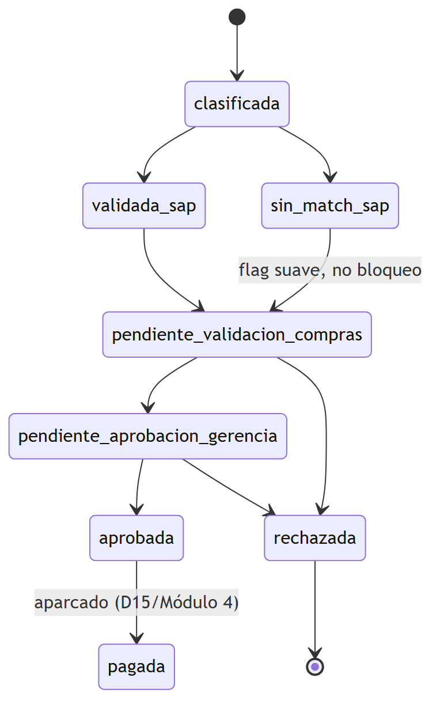
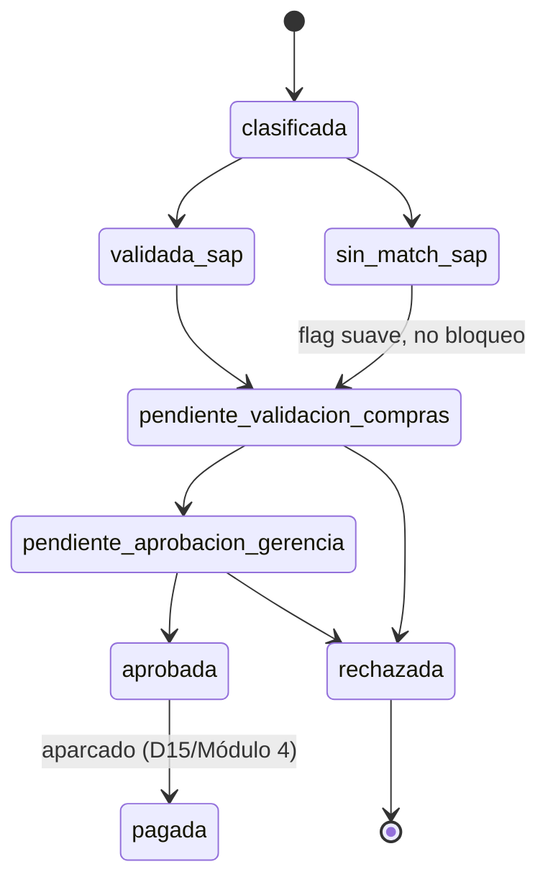

# Fase 2 — Decisiones de arquitectura

Diseño técnico de la herramienta (4 módulos + dashboard) sobre `apps/financialbi`
(FastAPI) y `apps/frontend` (Next.js), construido sobre la investigación de
[Fase 1](../PHASE1/resumen.md) (cerrada). Mapa de tablas nuevas en
[`Esquema.md`](./Esquema.md); SQL de producto en
[`../../ConsultasBigQuery/`](../../ConsultasBigQuery/).

## Arquitectura técnica

- **Carpetas:** `Datos/PHASE2/` = diseño (este documento + `Esquema.md` +
  `queries/` para investigación efímera de Fase 2, si hace falta — las
  investigaciones de datos que surgieron durante el diseño, como el bug de
  folio en BKPF/EKBE, se archivaron en `PHASE1/` por ser hallazgos de datos,
  no de arquitectura). `ConsultasBigQuery/` (raíz del repo, hermana de
  `apps/`) = el SQL de producto que construye las tablas de la herramienta —
  no es investigación, se mantiene y se re-ejecuta.
- **Menos queries, más largas:** en `ConsultasBigQuery/` se agrupa por
  módulo/capa, no un archivo por tabla — un `.sql` puede tener varias
  sentencias `CREATE OR REPLACE TABLE` encadenadas compartiendo CTEs.
- **Datasets BigQuery (reutilizados, sin crear ninguno nuevo):**
  `HCARB_STG_*` → `D50_AGGREGATE_RENTABILIDAD`; `HCARB_GOLD_*` →
  `D60_REPORTING` (mismo patrón que Maka: `D50` agregado/staging, `D60`
  reporting/gold, ahí ya viven las `MAKA_GOLD_*`).
- **Naming:** prefijo `HCARB_` en tablas y en los archivos `.sql` de
  `ConsultasBigQuery/`.
- **Orquestación:** **Airflow** (no Cloud Run Job + Scheduler como
  `materialize_alerts.py` de Maka). Las queries se corren primero a mano para
  el backfill histórico y luego quedan como tasks de un DAG.
- **Límite SQL vs backend:** "hacer una consulta y leer una tabla" → vive en
  `ConsultasBigQuery/` como tabla derivable, recalculable entera cada
  corrida. Si implica **estado mutable o acción humana** (aprobar, capturar
  CECO) → vive en el **backend** como tabla propia de la app, alimentada en
  solo-lectura por el pipeline pero actualizada por FastAPI. La consulta al
  estatus de cancelación SAT tampoco es "SQL sobre tablas existentes" — es
  una llamada a un servicio externo, y vive como pieza aparte (ver D24).

## Máquina de estados de la factura

Fuente editable en [`maquina-estados.mmd`](./maquina-estados.mmd). Para
regenerar: `npx -y @mermaid-js/mermaid-cli -i maquina-estados.mmd -o maquina-estados.png -b white -s 2`

- **`clasificada`** (M1, automático): la factura tiene ≥1 línea de gas
  (`HCARB_GOLD_CLASIFICACION_*`).
- **`validada_sap` / `sin_match_sap`** (M2, automático): ¿SAP FI registró la
  factura? (`HCARB_GOLD_VALIDACION_SAP`). `sin_match_sap` **no bloquea** —
  ~37% del histórico sin-match era timing/formato benigno (D18/D20); se
  re-evalúa en cada corrida del DAG.
- **`pendiente_validacion_compras`** (humano, rol Compras): captura CECO
  (siempre manual, D9/D22) y confirma/corrige el sitio (`WERKS`) cuando no
  vino derivado automático (~42%, D21).
- **`pendiente_aprobacion_gerencia`** (humano, rol Gerencia): ve
  proveedor/monto/CECO/sitio/estado SAP ya puestos por Compras, aprueba o
  rechaza (D23).
- **`pagada`**: aparcado (D15 de Fase 1) — no hay fuente de estatus de pago.

## Decisiones cerradas en Fase 2 (continúan la numeración de Fase 1, hasta D18)

| # | Tema | Decisión |
| --- | --- | --- |
| D19 | Grano de `HCARB_GOLD_CLASIFICACION` | Fila por línea-concepto, **todas** las líneas de facturas con ≥1 línea de gas (desglose completo, no solo líneas de gas), más un agregado por folio (`importe_gas`). Resuelve D12 en la práctica: la aprobación/pago sigue siendo por **factura completa** (`UUID`, unidad de registro en SAP), pero el monto de negocio que se trackea y reporta es `importe_gas` de línea, no `Total`. |
| D20 | Matcher CFDI↔SAP unificado | El fix de folio de D18 (número + fecha, no `Serie+Folio` exacto) se aplica **igual** a `bkpf_account_document_header` y a `sap_ekbe` — mismo campo `XBLNR`, mismo patrón de captura manual (§23). |
| D21 | Techo de sitio de consumo (`WERKS`) | ~58% es el techo práctico (52%→58% tras D20, §23) — el resto es estructural (compra sin pedido/recepción), no un bug de folio. El ~42% sin sitio automático se captura a mano junto con el CECO en `pendiente_validacion_compras`. |
| D22 | CECO — **revisada y revertida** (jul-2026) | Originalmente: "no usar `MSEG.KOSTL` como pre-relleno, cobertura marginal (2%)". Ese 2% era un bug de filtro (corregido, ver arriba). Medido el `KOSTL` real: de las 505 facturas con recepción MSEG, solo 201 (19% del total) tienen un único `KOSTL` limpio en su documento — la mitad de los documentos reparten el gasto entre 2-14 centros de coste distintos, sin que ninguno domine (verificado, no hay "el correcto" a adivinar). Pero se descubrió algo más fuerte: **6 de los 11 proveedores son de un solo sitio real** (≥95% de su historial MSEG cae en un único `KOSTL` — Villa Ahumada, Natgas Querétaro, Hidrogas Chihuahua, Gas San Juan, San Diego Matehuala, Super Gas de los Altos) — para esos, el CECO es predecible **por proveedor**, sin necesitar match de documento, y cubre **188 facturas**. **Decisión revertida a petición del usuario:** sí se pre-rellena (`ceco_sugerido`, editable, nunca bloquea — mismo principio de D29): patrón de proveedor si aplica, si no la lista de `KOSTL` del documento (uno o varios, sin elegir a ciegas). Cobertura total: **543/1.056 (51%)** con alguna sugerencia (292 únicas, 251 con varios candidatos). Implementado en `HCARB_gold_validacion_sap.sql` + `aprobacion_engine.py` + `aprobacion-workspace.tsx`. **Ampliación (mismo día):** la UI ahora resuelve código→nombre (`cecoLabel()`, con el detalle completo en tooltip si no cabe) en vez de mostrar solo el código; y `catalogo_ceco()`/`catalogo_sitios()` (el `<datalist>` de autocompletar) se acotaron a lo que YA apareció en datos de gas (MSEG + ya capturado a mano) en vez del catálogo completo de Proan — de 5.569 a 87 CECOs, de 492 a 7 sitios. Sigue sin bloquear: el `<datalist>` permite escribir cualquier código no listado. |
| D23 | Workflow de aprobación en dos roles | Fiel a la Propuesta original: **Compras** (`pendiente_validacion_compras`, captura CECO/sitio) → **Gerencia** (`pendiente_aprobacion_gerencia`, one-tap aprobar/rechazar viendo ya validado). Se descarta colapsarlo en un solo paso — Gerencia no conoce el CECO de memoria, y separar roles preserva control de cuatro ojos antes de una instrucción de pago. |
| D24 | D13 (cancelación SAT) — resuelto | Sí se intenta comprobar, pero como pieza aparte: tabla `HCARB_ESTATUS_SAT`, poblada por una task de Airflow que llama al webservice del SAT (no una columna calculada por SQL de `ConsultasBigQuery/`; el resultado cambia con el tiempo y depende de un servicio externo con límite de tasa). |
| D25 | Requisitos §4 de `Propuesta.md` | "IA de extracción" (leer XML/PDF para que el concepto cuadre con la clave SAT) y "sincronización tiempo real con maestro de materiales y CECO de SAP" quedan **descartados/reinterpretados**: la clasificación por clave SAT ya se validó suficiente en Fase 1 (sin NLP sobre texto libre); el CECO en tiempo real es inviable con los datos actuales (D9); la sincronización de maestro de materiales es cuestión de cadencia del pipeline existente, no un módulo nuevo. |
| D26 | `HCARB_GOLD_CLASIFICACION_LINEA` eliminada | Al ejecutar (jul-2026), salió con **1.051 filas — el mismo grano que `_FOLIO`, 1 a 1**. Los conceptos no-gas de una factura mixta **no se guardan como fila aparte en `cfdis`** (confirma hallazgo §16: el "otro concepto" solo se nota en que `SubTotal` > `Importe` de la línea de gas, no aparece desglosado). El "desglose completo" que motivó D19 **no existe en los datos** — tabla **eliminada** por redundante (no diseñar para datos hipotéticos futuros); reconstruible desde el historial de `HCARB_gold_clasificacion.sql` si aparece una fuente con desglose real. |
| D31 | Cutoff de fecha de negocio `>=2026-01-01` | `proan_MSEG_HIDROCARBUROS_20260714` solo cubre `MJAHR=2026` (Fase 1 §15), pero `cfdis` no tenía piso de fecha y arrancaba ~jun-2025 (Fase 1 §19.5) — ~7 de ~13-14 meses que MSEG **nunca podía validar** porque el dato no existe en SAP para ese rango, diluyendo artificialmente los indicadores de cobertura. Se corta en el único punto de entrada del universo (`HCARB_gold_clasificacion.sql`, `DECLARE cutoff_fecha_negocio` + `FechaTimbrado` **y** `Fecha` `>= cutoff`), todo lo demás (validación SAP, `catalog()`, dashboard, selector de fecha del frontend) lo hereda sin cambio de código. Efecto real (jul-2026): 1.056→**547** facturas; `confianza_mseg` (Alta/Media) sube de 48% a **90,7%** — confirma que el 48% previo estaba contaminado por meses sin cobertura MSEG posible, no por un techo de matching. `validada_sap` 91,0%, `con_sitio` 70,4%. Huérfanos pre-2026 en las tablas mutables `HCARB_gold_aprobacion` (509 filas, 0 ya `aprobada`/`rechazada`) y `HCARB_ESTATUS_SAT` (506 filas, 5 `cancelado`) — se **borraron explícitamente** (`DELETE`, autorizado), sin modo histórico paralelo (corte definitivo). |

*(D1/D2 siguen provisionales — "solo Proteína Animal + claves `151115xx`/
`83101600-01`" — explícitamente revisables, no ratificadas por negocio.)*

## Ejecución real (jul-2026)

Las 3 queries de `ConsultasBigQuery/` se ejecutaron contra BigQuery. De las 4
tablas `HCARB_*` creadas inicialmente, quedan **3** vivas
(`D50_AGGREGATE_RENTABILIDAD`/`D60_REPORTING`) — `_CLASIFICACION_LINEA` se
eliminó del `.sql` por D26 y se borró de BigQuery (`DROP TABLE`, autorizado
explícitamente).
Aparecieron 6 bugs reales que la revisión estática no detectó (detalle en el
header de cada `.sql`, resumen en `ConsultasBigQuery/README.md`). Cifras
finales, todas dentro de lo esperado por Fase 1: 1.051 facturas, ~$40.2M,
11 proveedores, **74.3% mixtas**, 955 `validada_sap` (90,4%; Fase-1-bis jul-2026:
RE 899 ∪ partida de proveedor, antes 898 solo RE), de ellas 600 pagadas / 4
pendientes, 569 con `sitio_consumo` (54%), 505 con recepción MSEG real (48%,
corregido jul-2026 — era 21/2%, bug de filtro por material en vez de proveedor,
ver `PHASE1/hallazgos.md` §27).

Nota sobre `sitio_consumo` (569, no 613): el ~613/58% de Fase 1 §23 salió de
una ventana de fecha **exploratoria** de ±45d para medir el techo del
problema; el matcher de producción usa la ventana **acordada** en D18/D20
(±15d), más estricta — 569 es el resultado correcto de aplicar la regla ya
decidida, no un bug. Si se quiere acercar más al 58%, sería ampliar la
ventana a propósito (decisión de diseño, no fix).

## Módulo 3 — backend construido (jul-2026)

Tabla + 7 endpoints (colas, catálogos de sugerencia, validar/aprobar/rechazar
por rol) construidos, probados contra BigQuery real y documentados en
`Esquema.md` §4. `sync_pendientes()` ya dio de alta las 1.051 facturas
existentes. Limpieza Maka-legacy de paso: se eliminaron `report_engine.py`,
`alertas_engine.py`, `agente.py`, `materialize_alerts.py`,
`test_ebitda_sign.py` de `apps/financialbi` (no aplicaban a este producto) —
ver [[hidrocarburos-colaboracion-codex]] en memoria. Frontend de M3
construido después (por Codex, y la reversibilidad por mí) — ver Esquema.md
§4.

## D24 (estatus SAT) y Dashboard — construidos y verificados (jul-2026)

**D24 ya no es solo diseño (D30) — está implementado y probado en vivo**
contra el webservice real del SAT (no un mock): 2 facturas reales + 1 UUID
inventado, los 3 resultados posibles confirmados. Corrección real encontrada
al verificar contra la WSDL: el parámetro se llama `expresionImpresa`, no
`expresionImpresionFiscal`. Detalle completo, incluido el hallazgo de una
factura real ya cancelada ante el SAT, en `Esquema.md` §5.

**Dashboard construido** (`Esquema.md` §6): un endpoint agregando resumen de
estatus + gasto por CECO/sitio/periodo, probado contra BigQuery real.

Con esto, **M1+M2+M3+D24+Dashboard están construidos** — queda M4 (aparcado,
sin fuente de datos) y Airflow (orquestación, ver pendientes) como lo
explícitamente fuera de este MVP.

## Pendientes / próximos pasos

1. **Ratificar D1/D2** con negocio.
2. **Correr `python -m financialbi.estatus_sat`** para el resto de las ~1.049
   facturas sin consultar todavía (ritmo secuencial, ~1.049 segundos) — hecho
   a mano hasta que exista Airflow.
3. **Diseñar el DAG de Airflow** que orquesta `ConsultasBigQuery/` (orden:
   `HCARB_stg_vendors` → `HCARB_gold_clasificacion` → `HCARB_gold_validacion_sap`)
   y `estatus_sat.py` — el proyecto GCP ya tiene roles de Cloud Composer
   asignados a la service-account, así que Airflow tiene infraestructura de
   base ya aprovisionada.
4. **Probar el flujo completo en el navegador** — todo verificado por código
   + BigQuery + SAT real + tsc/lint, pero nadie ha confirmado que corra
   end-to-end en el navegador con los 3 módulos + dashboard a la vez.
5. **Auth real (D27 opción B)** y **commitear** el trabajo pendiente desde
   `487000c` (M3 reversibilidad, D24, Dashboard).
